[Sobre a Aplicação]: #sobre-a-aplicação
[Operações do Sistema]: #operacoes-do-sistema
[Instalando o Docker-CE]: #instalando-o-docker-ce
[Iniciando o conteiner da aplicação]: #inciando-o-conteiner-da-aplicação
[Compilando a imagem Docker da aplicação]: #compilando-a-imagem-docker-da-aplicação
[Executando a aplicação usando o DockerCompose]: #executando-a-aplicação-usando-o-DockerCompose
[Monitorando a API da aplicação com o Zabbix]: #monitorando-a-API-da-aplicação-com-o-zabbix
[Monitorando a API da aplicação com o Grafana]: #monitorando-a-API-da-aplicação-com-o-grafana
[Referências do Docker]: #referências-do-docker

# Conteúdo
1. [Sobre a Aplicação][Sobre a Aplicação]
    - [Operações do Sistema][Operações do Sistema]
2. [Instalando o Docker-CE][Instalando o Docker-CE]
3. [Iniciando o conteiner da aplicação][Iniciando o conteiner da aplicação]
4. [Compilando a imagem Docker da aplicação][Compilando a imagem Docker da aplicação]
5. [Executando a aplicação usando o DockerCompose][Executando a aplicação usando o DockerCompose]
6. [Monitorando a API da aplicação com o Zabbix][Monitorando a API da aplicação com o Zabbix]
7. [Monitorando a API da aplicação com o Grafana][Monitorando a API da aplicação com o Grafana]
8. [Referências do Docker][Referências do Docker]

# Sobre a Aplicação

O objetivo desta aplicação é simular operações bancárias.

## Operações do sistema:

A seguir estão os endpoints disponíveis na API Swagger da aplicação.

* Cadastrar Pessoas

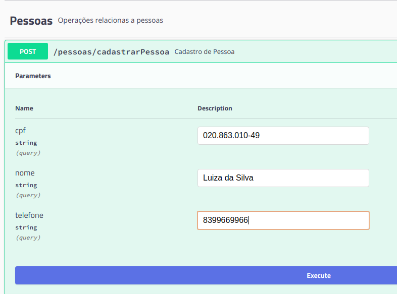

* Listar Pessoas

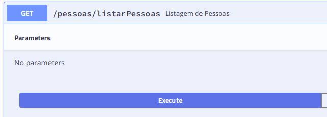

* Criar Conta

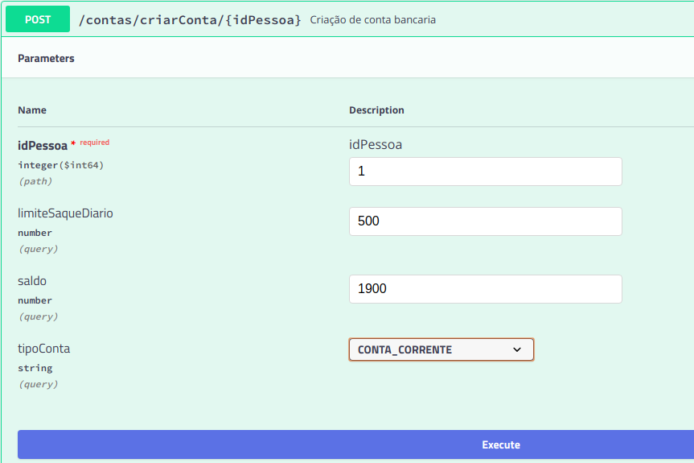

* Bloquear Conta

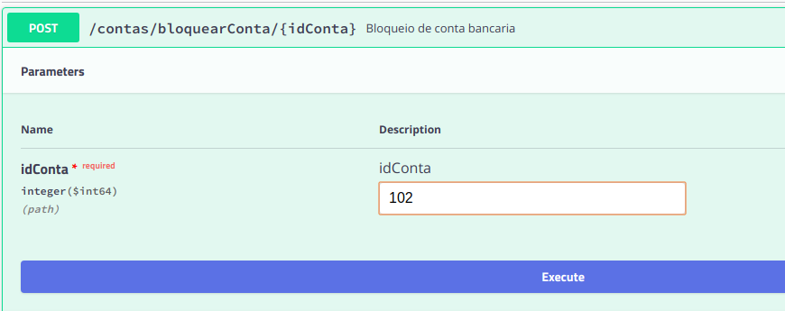

* Desbloquear Conta

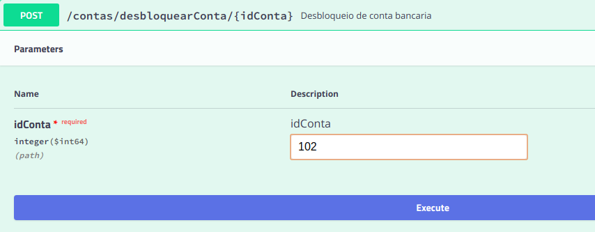

* Listar Contas 

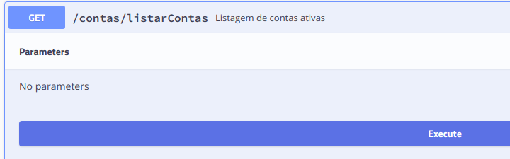

* Consultar Saldo

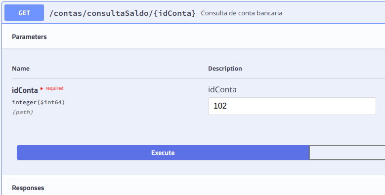

* Depósito

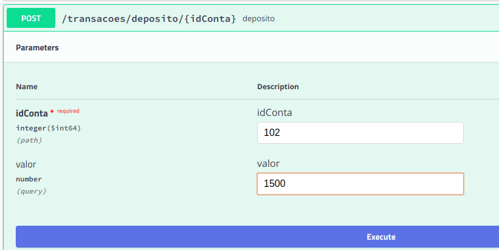

* Saque

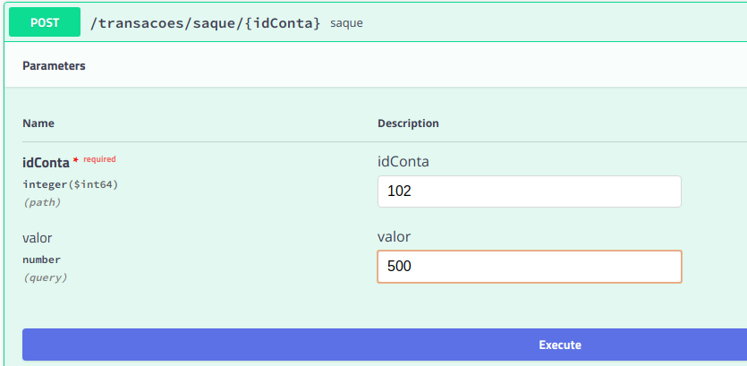

* Extrato de Conta

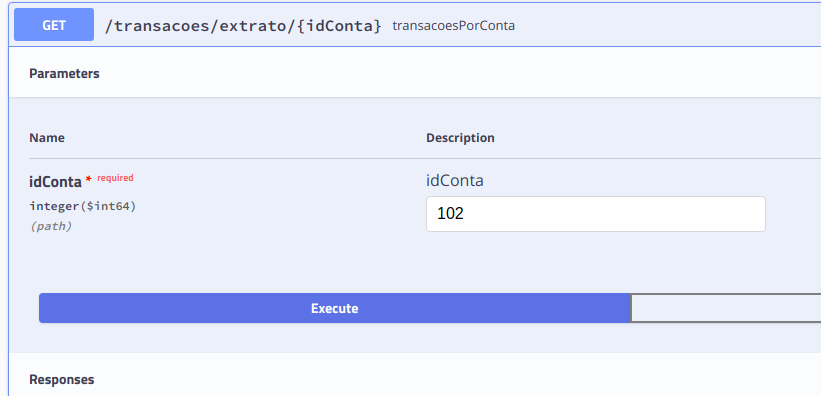

* Extrato de Conta por Período

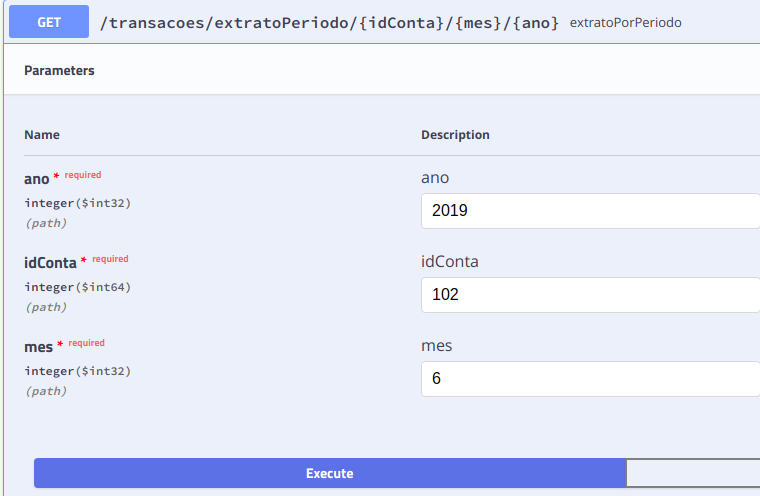

# Instalando o Docker-CE

* Instale o Docker-CE seguindo as instruções das páginas abaixo de acordo com a
distribuição GNU/Linux.

No Ubuntu: https://docs.docker.com/install/linux/docker-ce/ubuntu

No CentOS: https://docs.docker.com/install/linux/docker-ce/centos

No Debian: https://docs.docker.com/install/linux/docker-ce/debian

* Altere o valor da variárel ``USUARIO`` pelo nome da sua conta no S.O no qual
o Docker foi instalado e execute os comandos abaixo para adicionar o seu usuário
 ao grupo Docker.

```bash
USUARIO="seu-nome-usuario"
sudo usermod -aG docker $USUARIO
sudo setfacl -m user:$USUARIO:rw /var/run/docker.sock
```

# Iniciando o conteiner da aplicação

Use o comando a seguir para iniciar um conteiner do banco de dados.

```sh
sudo mkdir -p /docker/postgresql/sistema-bancario/data
sudo chown -R 999:999 /docker/postgresql/sistema-bancario/data

docker run -p 5433:5432 -d --name postgres \
--restart=always \
-v /docker/postgresql/sistema-bancario/data:/var/lib/postgresql/data \
-e POSTGRES_DB="sistema-bancario" \
-e POSTGRES_PASSWORD="postgres" \
-e POSTGRES_USER="postgres" \
postgres
```

Use o comando a seguir para iniciar um conteiner da aplicação.

```sh
docker run -d -p 8080:8080 --name sistema-bancario \
-e DATASOURCE_URL="postgresql://172.17.0.1:5433/sistema-bancario" \
-e DATASOURCE_USERNAME="postgres" \
-e DATASOURCE_PASSWORD="postgres" \
jmilitao/sistema-bancario:latest
```

Acesse a API da aplicação na URL http://172.17.0.1:8080/swagger-ui.html

Use os comandos a seguir visualizar o log dos conteineres.

```sh
docker logs -f postgres
docker logs -f sistema-bancario
```

# Compilando a imagem Docker da aplicação

Para saber como gerar um novo pacote e uma nova imagem Docker da aplicação acesse as instruções [aqui](README_DOCKER_APP.md).

# Executando a aplicação usando o DockerCompose

Para saber como executar a aplicação usando o DockerCompose acesse as instruções [aqui](README_DOCKERCOMPOSE.md).

# Monitorando a API da aplicação com o Zabbix

O Zabbix pode ser instalado usando um dos seguintes tutoriais disponíveis na comunidade Zabbix-BR: [http://zabbixbrasil.org/?page_id=7](http://zabbixbrasil.org/?page_id=7).

Este template foi criado com base no conhecimento compartilhado na apresentação de [André  Déo](https://www.linkedin.com/in/andr%C3%A9-d%C3%A9o-6446b58/) e [Thales Reis](https://www.linkedin.com/in/thales-reis-3a59822a/) [https://pt.slideshare.net/andredeo/monitoramento-de-aplicaes-web-modernas-com-zabbix](https://pt.slideshare.net/andredeo/monitoramento-de-aplicaes-web-modernas-com-zabbix)

Foi criado este o [Template_Monitoramento_API_Sistema_Bancario.xml](template-zabbix/Template_Monitoramento_API_Sistema_Bancario.xml) para monitorar os endpoints da API.

Abaixo estão algumas imagens do template sendo utilizado.

* Monitoramento da API usando cenário web

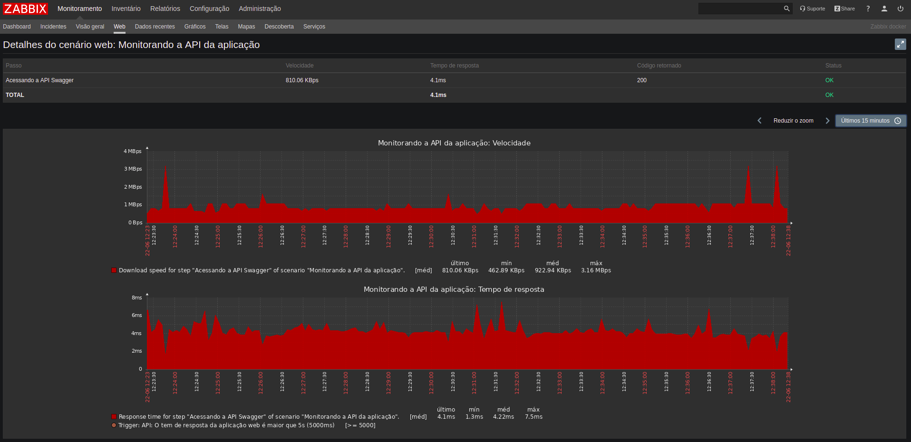

* Grafico saldo conta via LLD

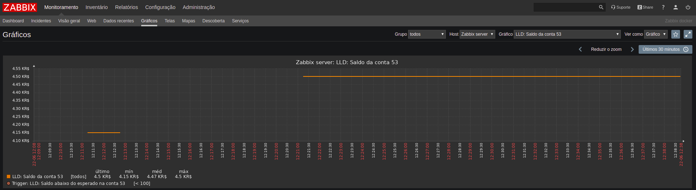

* Trigger criada limite conta via LLD

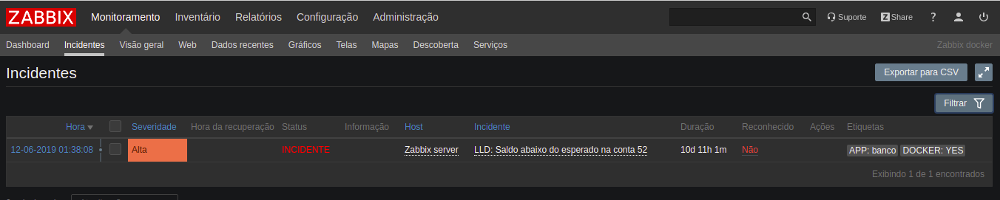

* Dados recentes:

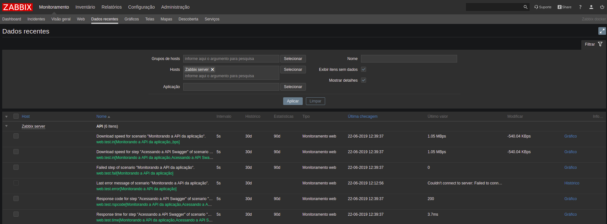
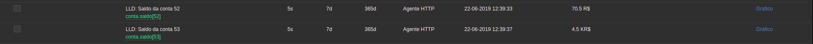
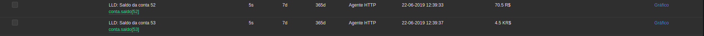

# Monitorando a API da aplicação com o Grafana

O Grafana pode ser instalado usando um dos seguintes tutoriais disponíveis na comunidade Zabbix-BR: [http://zabbixbrasil.org/?page_id=7](http://zabbixbrasil.org/?page_id=7) e no site do Grafana [https://grafana.com/grafana/download](https://grafana.com/grafana/download).

Foi criado este o [Dashboard-Sistema_Bancario.json](dashboard-grafana/Dashboard-Sistema_Bancario.json) para exibir os dados coletados pelo Zabbix de forma mais agradável.

Abaixo está uma imagem do dashboard sendo utilizado.

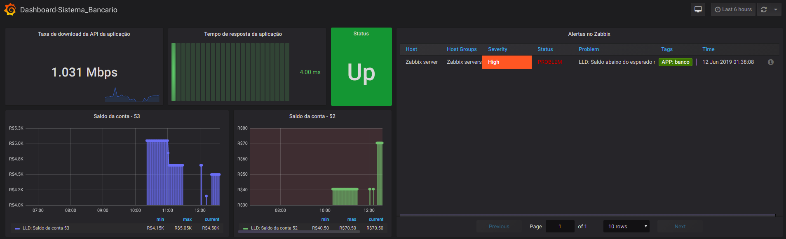

# Referências do Docker

https://docs.docker.com/engine/tutorials/dockerimages/

https://www.digitalocean.com/community/tutorials/how-to-install-and-use-docker-on-ubuntu-16-04

https://docs.docker.com/engine/reference/commandline/commit/

https://www.digitalocean.com/community/tutorials/docker-explained-how-to-create-docker-containers-running-memcached